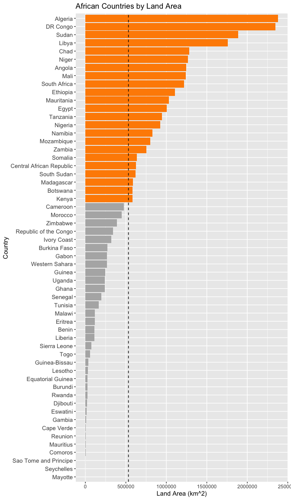
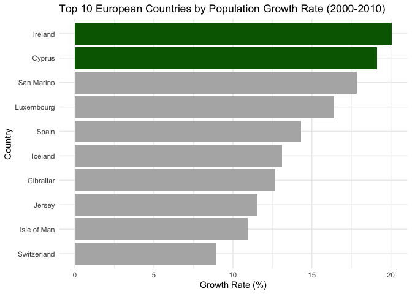

Global Overpopulation Risk Analyis
================
Anvit Watwani
2026-04-02

Importing the dataset and packages

``` r
df <- read.csv(file = "https://docs.google.com/uc?id=1G0UbhoQZijI3NotLZhhTgHO_ruANYCCN&export=download", header = TRUE)
library(tidyverse)
```

    ## ── Attaching core tidyverse packages ──────────────────────── tidyverse 2.0.0 ──
    ## ✔ dplyr     1.1.4     ✔ readr     2.1.6
    ## ✔ forcats   1.0.1     ✔ stringr   1.6.0
    ## ✔ ggplot2   4.0.1     ✔ tibble    3.3.0
    ## ✔ lubridate 1.9.5     ✔ tidyr     1.3.1
    ## ✔ purrr     1.2.0     
    ## ── Conflicts ────────────────────────────────────────── tidyverse_conflicts() ──
    ## ✖ dplyr::filter() masks stats::filter()
    ## ✖ dplyr::lag()    masks stats::lag()
    ## ℹ Use the conflicted package (<http://conflicted.r-lib.org/>) to force all conflicts to become errors

## Question 1

How many African countries have a land area larger than the continental
average? Provide the average area, to the nearest tenth decimal (e.g.,
10.5%), and the count of countries exceeding it.

``` r
#narrow down to just africa
africa <- df[df$Continent == "Africa",]

#find average
avg_area <- mean(africa$Area)
amt_larger_than_average <- sum(africa$Area > avg_area)
avg_area
```

    ## [1] 531894.1

``` r
amt_larger_than_average
```

    ## [1] 23

``` r
#visualize each country's area against the continental average
ggplot(africa, aes(x = reorder(Country, Area), y = Area, fill = Area > avg_area)) +
  geom_col() +
  geom_hline(yintercept = avg_area, linetype = "dashed", color = "black") +
  coord_flip() +
  scale_fill_manual(values = c("TRUE" = "darkorange", "FALSE" = "gray70"), guide = "none") +
  labs(
    title = "African Countries by Land Area",
    x = "Country",
    y = "Land Area (km^2)"
  ) + 
    theme(axis.text.y = element_text(size = 10))
```

<!-- -->

The average area of all African countries is 531,894.1 km^2.

23 African countries exceed this average.

## Question 2

Within the continent of Europe, identify the two countries with the
highest and second highest growth rate between 2000 and 2010. Report the
population growth rate as a percentage, rounded to the nearest tenth.

``` r
#add feature for growth rate and sort by growth rare descending
europe <- df |> filter(Continent=="Europe") |> mutate(growth_rate_pct = 100*(X2010.Population-X2000.Population)/X2000.Population) |> arrange(desc(growth_rate_pct))
top_2_countries <- europe$Country[c(1,2)]
top_2_pcts <- europe$growth_rate_pct[c(1,2)]
top_2_countries
```

    ## [1] "Ireland" "Cyprus"

``` r
top_2_pcts
```

    ## [1] 20.04895 19.13541

``` r
#visualize the top 10 European countries by growth rate, highlighting the top 2
top10_europe <- europe |> slice_head(n = 10)

ggplot(top10_europe, aes(x = reorder(Country, growth_rate_pct), y = growth_rate_pct,
                          fill = Country %in% top_2_countries)) +
  geom_col() +
  coord_flip() +
  scale_fill_manual(values = c("TRUE" = "darkgreen", "FALSE" = "gray70"), guide = "none") +
  labs(
    title = "Top 10 European Countries by Population Growth Rate (2000-2010)",
    x = "Country",
    y = "Growth Rate (%)"
  ) +
  theme_minimal()
```

<!-- -->

The top 2 European countries in terms of population growth between 2000
and 2010 are Ireland and Cyprus, with growth rates of 20.0% and 19.1%
respectively.

## Challenge Question 1

Your colleague claims that in 2010 countries with larger land areas
tended to have lower population density. Using the dataset, analyze the
relationship between land area and population density, and clearly state
whether you support or oppose the claim. Justify your position with
evidence and quantify any relationships that you observe. Conclude by
discussing potential limitations of your analysis. (Note: population
density must be calculated: Population Density = Total Population / Land
Area)

``` r
#create population density variable 
df <- df |> mutate(pop_density_2010 = X2010.Population/Area)

#look at the correlation
cor(df$Area, df$pop_density_2010)
```

    ## [1] -0.06467746

``` r
#create a linear regression model
model <- lm(df$pop_density_2010 ~ df$Area)
summary(model)
```

    ## 
    ## Call:
    ## lm(formula = df$pop_density_2010 ~ df$Area)
    ## 
    ## Residuals:
    ##     Min      1Q  Median      3Q     Max 
    ##  -432.1  -364.2  -316.4  -158.2 18143.4 
    ## 
    ## Coefficients:
    ##               Estimate Std. Error t value Pr(>|t|)    
    ## (Intercept)  4.331e+02  1.214e+02   3.567 0.000439 ***
    ## df$Area     -6.474e-05  6.558e-05  -0.987 0.324571    
    ## ---
    ## Signif. codes:  0 '***' 0.001 '**' 0.01 '*' 0.05 '.' 0.1 ' ' 1
    ## 
    ## Residual standard error: 1764 on 232 degrees of freedom
    ## Multiple R-squared:  0.004183,   Adjusted R-squared:  -0.0001091 
    ## F-statistic: 0.9746 on 1 and 232 DF,  p-value: 0.3246

Initially, I checked the correlation between the variables, with land
area as my explanatory variable and population density in 2010 as my
response variable. My correlation coefficient was -0.065, which, while
indicating the negative relationship proposed by the colleague, is still
very close to zero. Therefore, I also created a linear regression model
to further my analysis. This model returned an R^2 value of 0.004,
meaning that only 0.4% of the association in the data can be explained
by a linear relationship, as well as a p-value of 0.3246 for the
hypothesis test of linear regression, both of which suggest that there
is likely no linear relationship between area and population density.

While there may be a slight negative association, I oppose my
colleagues’ claim due to the quantitative evidence I just discussed.
Some limitations of my methods include that it does not check for
nonlinear relationships which may indicate strong negative relationship
between the variables. It could also be beneficial to try different
transformations like a log transformation of one of the variables to
create a stronger fit for the linear regression. Lastly, it would be
beneficial to look at other factors that may influence population
density, like geographic terrain or small city states that could
represent outliers within the data due to being very small yet dense,
rather than just using area alone as an explanatory variable.

## Challenge Question 2

<u>Scenario</u>**:** You have been hired by an international development
agency to identify regions at extreme risk of overpopulation to help
plan for sustainable development.

<u>Your Task:</u>

Analyze Patterns: Explore the relationships between population density,
historical population trends, and any other demographic factors you deem
relevant

Strategic Prioritization: Identify at least one country that you would
prioritize for intervention or support.

<u>In your final answer must:</u>

Explain Your Methodology: Clearly detail the analytical approach you
took, including any specific calculations, data manipulation, or methods
you used. Be sure to explain why you chose these specific approaches and
why you selected the variables included in your analysis.

Justify Your Conclusion: Support your final country selection strictly
using quantitative evidence derived from your analysis of the data.

``` r
#create growth rate percentage variable
df<- df |> mutate(growth_rate_pct = 100*(X2010.Population-X2000.Population)/X2000.Population) |> arrange(desc(growth_rate_pct))

#create an average of each country's rankings in three factors: population density in 2010 as well as growth rate between 2000 and 2010 (to measure risk of overpopulation)
df<- df|> mutate(Rank_pop_dens = rank(-pop_density_2010), Rank_growth_rate = rank(-growth_rate_pct), avg_rank = (Rank_pop_dens+Rank_growth_rate)/2) |> arrange(avg_rank)
df|>select(Country, avg_rank)|>head()
```

    ##     Country avg_rank
    ## 1   Bahrain      4.5
    ## 2     Macau     24.5
    ## 3   Burundi     25.0
    ## 4 Singapore     27.5
    ## 5   Mayotte     28.5
    ## 6  Maldives     29.0

``` r
#Factoring in population size as a third ranking criterion, so larger countries (more people affected) are weighted alongside density and growth
df <- df|> mutate(Rank_population = rank(-X2010.Population), Rank_pop_dens = rank(-pop_density_2010), Rank_growth_rate = rank(-growth_rate_pct), avg_rank = (Rank_population+Rank_pop_dens+Rank_growth_rate)/3) |> arrange(avg_rank)
df|>select(Country, avg_rank)|>head()
```

    ##       Country avg_rank
    ## 1     Nigeria 40.66667
    ## 2  Bangladesh 41.00000
    ## 3    Pakistan 41.66667
    ## 4       India 42.00000
    ## 5 Philippines 46.00000
    ## 6     Burundi 47.33333

According to purely this data alone, my initial choice was to prioritize
Bahrain for intervention due to overpopulation concerns. The way I
arrived at this conclusion was by manipulating the dataset, using the
variables population density in 2010 (pop_density_2010) and growth rate
between 2000 and 2010 (growth_rate_pct). I chose these variables because
I felt that a country that was very dense population wise and that had a
rapidly growing population would clearly be one at risk for
overpopulation. I ranked these two variables in descending order,
creating two new columns (Rank_pop_dens and Rank_growth_rate using
tidyverse) and then averaged each country’s rankings (avg_rank) to find
the country that had high numbers for both of these categories,
signifying a country at risk of overpopulation. After doing this,
Bahrain was ranked number 1, ranking in the top 10 for both population
density and growth rate between 2000 and 2010, which is why, purely
according to this numeric data, I would prioritize it for intervention.

Later, I realized it may be more important to prioritize countries that
have larger populations as well, because it is likely that more people
would be affected and resources would even more sparse. Therefore, I
added population as a factor taken into account in the average rankings,
which resulted in countries like Nigeria and Bangladesh moving up to
spots 1 and 2 respectively in my prioritization rankings. Therefore,
these are the countries I’d want to pay attention to for risk of
overpopulation.
